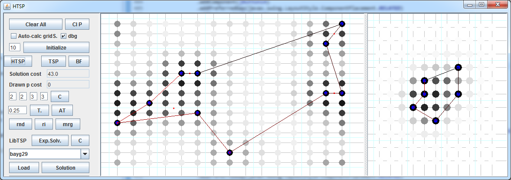

Hierarchical convex hull-based heuristic for solving the Traveling Salesman Problem
=============

Research-grade java code implementing a O(n) heuristic for solving the Traveling Salesman Problem (TSP). This code was not designed to be performant (for speed, check out [Concorde](http://www.math.uwaterloo.ca/tsp/concorde.html)). Instead, the goal was to create a psychologically plausible cognitive model of how humans solve the TSP. Details, evaluation against human data, and arguments regarding neural plausibility can be found in [this technical report](madl_tsp_paper.pdf).
